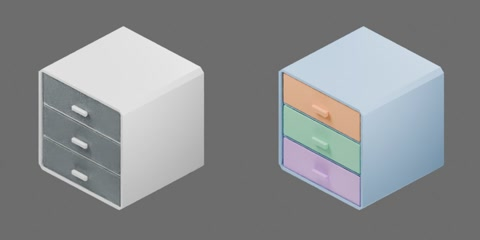

# 三抽屉塑料盒（橡胶脚垫）



乳白色柜壳带三个半透明抽屉和四个黑色橡胶脚垫，约 286 × 285 × 290 mm。包括四个刚体：外壳及三个抽屉。三个 SLIDER 关节限位均为 [0, 0.173] m，正值沿 −Y 拉出，零位闭合；原点为脚垫落地面中心。

```text
cabinet
  drawer1..3 [rigid]
    bottom
    front
    handle
    rear
    side1..2
  housing [rigid]
    back
    rubber_pad1..4
    shelf1..2
    shell
```
