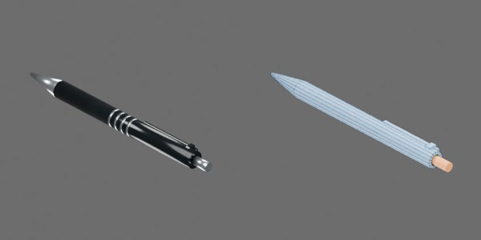

# 黑色按动圆珠笔



黑色漆面、银色鼻锥与四圈握环，保留原资产 UUID。按照片与尺度线索建模，约 149 × 13 × 14 mm。

笔壳、按钮、笔芯共三个 Compound 刚体。空心笔壳与鼻锥采用 16 段闭合凸碰撞块，留出按钮和笔芯通道；握环仅作为视觉细节。

原点在笔杆中点下方，杆中心 Z=0.006 m；+X 沿长度指向按钮，+Y 为宽度，+Z 向上，笔尖朝 −X。

两个原生 `SLIDER`：`button_press` 与 `refill_extend`，各限位 [−0.003, 0] m。负值向笔尖平移。`press_and_extend.mp4` 以 24 FPS 演示按压、伸芯、按钮释放与再次按压收芯；这是独立指定的几何行程，未模拟按压自锁、凸轮或弹簧动力学。

在仓库根目录生成并验收：

```bash
blender -b --python-exit-code 1 -P asset_sources/objects/pen/000000/object.py -- --output assets/objects/pen/000000
uv run python scripts/assets/validate_and_preview.py assets/objects/pen/000000/object.blend --views asset_sources/objects/pen/000000/preview.json
```

`three_quarter.jpg` 为 600 × 300 的源目录缩略图，左视觉、右碰撞，随 Git 提交。完整模型、六视图、动画和验收报告保存在生成目录，不提交。资产身份见 `metadata.json`；修改既有资产时保留 UUID。

生成目录还保存 `asset_builders.py`，与 `object.py`、`preview.json` 和 `metadata.json` 构成可独立重建的源码快照。共用函数在 `table_1000/modeling/asset_builders.py` 维护。
