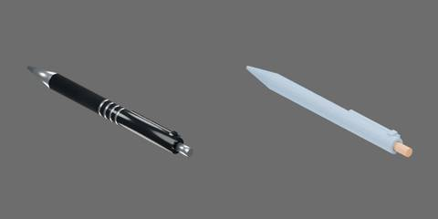

# 黑色按动圆珠笔



黑色漆面笔杆、银色鼻锥与握环，约 149 × 13 × 14 mm。

包括两个刚体组件：笔身；笔尖、笔芯和后部按钮构成的活动组件。滑动关节 `button_press` 限位 [−0.003, 0] m，负值使活动组件一起朝笔尖方向移动。

```text
pen
  refill [rigid]
    button
    shaft
    tip
  shell [rigid]
    barrel
    clip
    clip_bridge
    grip_band1..4
    nose
```
