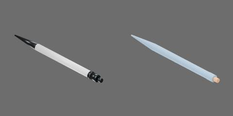

# 白黑色按动圆珠笔



白色笔杆、黑色后壳与长鼻锥，约 162 × 11 × 11 mm。

包括两个刚体组件：笔身；笔尖、笔芯和后部按钮构成的活动组件。滑动关节 `button_press` 限位 [−0.003, 0] m，负值使活动组件一起朝笔尖方向移动。

```text
pen
  refill [rigid]
    button
    shaft
    tip
  shell [rigid]
    barrel
    nose
    rear_housing
    shoulder
```
