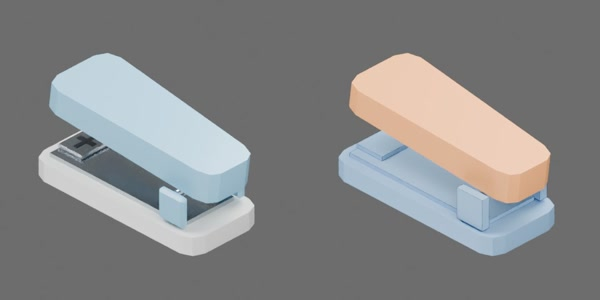

# 白蓝迷你订书机



白色浅底座、连续浅蓝上盖、钢制订书槽和砧座；保留真实开放喉口。约 70 × 30 × 37 mm（零位）。

基座与活动上部共两个 Compound 刚体。上盖、钢槽和压针件作为同一活动组件；闭合凸板件和 BOX 碰撞保留喉口与后铰链间隙。

原点为底座底面中心；+X 沿长度指向后铰链，+Y 为宽度，+Z 向上，订书口朝 −X。

原生 `HINGE`：`upper_press`，轴沿 +Y，零位在参考静态姿态，限位 [−0.27, 0.70] rad；负值按压至压针件接近砧座，正值展开。`press_and_open.mp4` 以 24 FPS 覆盖零位和两个限位。当前只验证行程与碰撞空间；弹簧回弹、纸张和订书钉动力学留待下一阶段。

在仓库根目录生成并验收：

```bash
blender -b --python-exit-code 1 -P asset_sources/objects/stapler/000000/object.py -- --output assets/objects/stapler/000000
uv run python scripts/assets/validate_and_preview.py assets/objects/stapler/000000/object.blend --views asset_sources/objects/stapler/000000/preview.json
```

`three_quarter.jpg` 为 600 × 300 的源目录缩略图，左视觉、右碰撞，随 Git 提交。完整模型、六视图、动画和验收报告保存在生成目录，不提交。资产身份见 `metadata.json`；修改既有资产时保留 UUID。

生成目录还保存 `asset_builders.py`，与 `object.py`、`preview.json` 和 `metadata.json` 构成可独立重建的源码快照。共用函数在 `table_1000/modeling/asset_builders.py` 维护。
