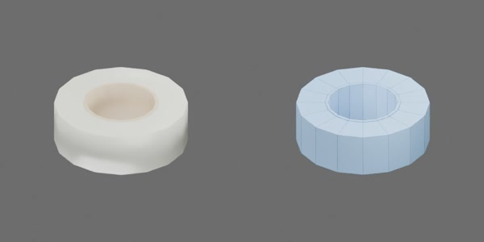

# 半透明胶带卷



乳白胶带和纸芯，外径 61 mm、中孔内径 31.6 mm、厚 20.4 mm。

一个 Compound 刚体，胶带和纸芯各由 16 个闭合凸扇区组成。视觉与碰撞均保留贯通中孔，不用整体凸包封住孔洞。

原点为卷底中心；+X、+Y 为径向，+Z 为胶带卷轴线。

无关节；`preview.json` 提供六视图和四分之三视图。

在仓库根目录生成并验收：

```bash
blender -b --python-exit-code 1 -P asset_sources/objects/tape/000000/object.py -- --output assets/objects/tape/000000
uv run python scripts/assets/validate_and_preview.py assets/objects/tape/000000/object.blend --views asset_sources/objects/tape/000000/preview.json
```

`three_quarter.jpg` 为 600 × 300 的源目录缩略图，左视觉、右碰撞，随 Git 提交。完整模型、六视图、动画和验收报告保存在生成目录，不提交。资产身份见 `metadata.json`；修改既有资产时保留 UUID。

生成目录还保存 `asset_builders.py`，与 `object.py`、`preview.json` 和 `metadata.json` 构成可独立重建的源码快照。共用函数在 `table_1000/modeling/asset_builders.py` 维护。
