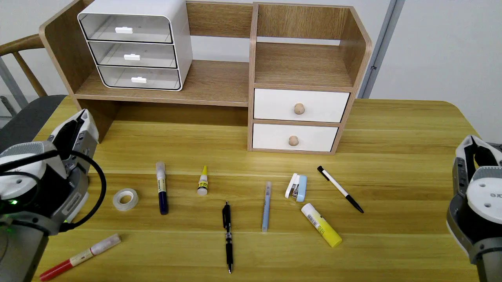

# 01 单图资产建模与形状验收

本章以三抽屉塑料盒子和黑色圆珠笔为例，完成 **参考图片 → Python 建模 → 配置预览 → 自动检查与渲染 → 人工验收**。AI 应阅读完整章节后编写或修改资产源码；本章的约束和验收要求共同构成建模任务。

本阶段同时完成视觉与碰撞形状，验证活动空间和复杂度。质量、摩擦、受力运动及 USDZ 导出在下一章处理。

## 1. 准备输入与环境

**输入：** 下面的单张照片。目标是左上方的三抽屉盒子，以及桌面中下方带银色环的黑色圆珠笔。尺寸和不可见结构由 AI 根据图片与常识推断。



参考图随教程保存；源目录的 README 和四分之三缩略图随 Git 保存，完整模型和预览不进入 Git。示例源码和配置位于：

- [盒子](../../asset_sources/objects/cabinet/000000/)：外壳、三个空心抽屉，共四个刚体。
- [笔](../../asset_sources/objects/pen/000001/)：笔壳与包含按钮、笔芯、笔尖的活动组件，两个刚体与一个滑动关节。

同一照片中的其他文具也提供独立源码：[白黑按动笔](../../asset_sources/objects/pen/000002/)、[订书机](../../asset_sources/objects/stapler/000000/)、[尖嘴胶水](../../asset_sources/objects/glue/000000/)、[固体胶](../../asset_sources/objects/glue/000001/)和[胶带](../../asset_sources/objects/tape/000000/)。各目录 README 展示缩略图并简述资产尺寸、组件与关节。原单刚体黑笔保留在 [pen/000000](../../asset_sources/objects/pen/000000/)，本章使用新增的黑色按动笔 pen/000001。

安装 uv、Blender 和 FFmpeg，并确保终端能找到 `uv`、`blender`、`ffmpeg`。本章实测 Blender 4.5.14 LTS。以下命令均在仓库根目录执行：

```bash
uv sync --locked
```

外层 uv 环境负责启动 Blender，没有运行时第三方依赖。建模、检测和渲染使用 Blender 自带的 Python、bpy、bmesh、mathutils 和 NumPy，通过源码路径导入本项目；无需向 Blender 安装宿主 `.venv` 的依赖。

## 2. 编写资产源码

**输入：** 参考图、以下结构约束和第 4 节的验收要求。

**输出：** 每个资产目录中的 `object.py`、`metadata.json`、`preview.json` 和简洁 `README.md`，验收后保存 `three_quarter.jpg` 缩略图。预览配置按第 4.1 节设计，可在建模迭代中调整。

每个 `object.py` 只生成自己的资产，提供统一入口 `main(argv=None)`，用 `--output` 指定产物目录。修改示例时保留已有 UUID。示例材质使用 Blender 内置节点和脚本参数，无外部纹理依赖。

### 刚体与几何

每个刚体对应一棵明确标识的完整子树，视觉与碰撞几何都有唯一的刚体归属。整体允许树或森林，不要求统一总根或固定层数。

Object 是父子树的节点。Mesh Object 引用 Mesh 数据块，Empty 没有网格数据。本例使用 Blender **Compound**：刚体根是零顶点 Mesh Object，直接子级的碰撞形状共同构成一个刚体，根本身不增加实心几何。

```text
盒子资产坐标（Empty）
├─ 外壳刚体根（Compound）
│  ├─ 视觉对象：壳体、背板、隔板等
│  └─ 碰撞对象：凸壳体分段、盒形板件等
├─ 上抽屉刚体根（Compound）
│  ├─ 视觉对象：前板、侧壁、底板、背板、拉手等
│  └─ 碰撞对象：对应板件与拉手
├─ 中抽屉刚体根（Compound）
└─ 下抽屉刚体根（Compound）
三个独立关节对象：分别引用外壳根和对应抽屉根
```

黑笔采用笔壳和活动组件两个 Compound 根。后部按钮、笔芯和笔尖属于同一个完整活动子树，通过一个 `SLIDER` 连接笔壳并共同运动。笔壳及鼻锥的碰撞由闭合凸扇区构成，保留笔芯运动通道；不把空心壳体变成一个实心凸包。按压与伸缩仅指定几何行程，按压自锁、凸轮和弹簧动力学在下一阶段处理。

视觉对象不设刚体；碰撞子对象关闭渲染显示。这些子对象提供碰撞形状，不是独立运动的刚体。使用多个基础形状或凸块保留空腔和活动间隙，不能将整只空心抽屉合并后求一个凸包。视觉与碰撞网格可以不同，但接触表面应匹配。

| 信息 | 脚本约定 |
| --- | --- |
| 刚体身份 | 根对象 `rigid_body_root = True`，碰撞形状 `COMPOUND` |
| 几何用途 | 子对象 `geometry_role = "visual"` 或 `"collision"` |
| 关节 | 原生 Rigid Body Constraint，`preview_joint = True`；约束对象名作为关节名 |
| 零位与限位 | 保存模型时的装配姿态为零位；滑动用米、转动用弧度，限位须包含零位 |
| 禁碰关系 | 关节 `disable_collisions`；示例三个关节均不禁碰 |
| 穿透容差 | Scene 的 `penetration_tolerance_m`，示例为 0.0002 m |

使用米制，应用缩放和碰撞修改器。当前粗测支持 `BOX` 和显式闭合凸网格 `CONVEX_HULL`，不自动分解凹网格；碰撞形状须开启裕量设置并设为零。预览支持滑动关节 `SLIDER` 和旋转关节 `HINGE`，关节连接须无环，每个运动刚体只能有一个上游关节。

**TODO：接入现成碰撞引擎的查询接口，替换自写检测并支持其他基础形状。当前形状限制是实现限制，不是长期资产规范。**

### 局部坐标与复杂度

按物体常识定义原点和局部坐标，所有部件共用明确的资产参考系。预览使用带 `asset_id` 的顶层对象作为参考系；没有该对象时使用场景坐标系。

| 资产 | 原点和坐标 |
| --- | --- |
| 盒子 | 外壳底面中心；+X 宽度、+Y 背面、+Z 向上；抽屉沿 −Y 拉出 |
| 笔 | 笔杆中点下方；+X 指向按钮、+Z 向上，笔尖朝 −X |
| 胶水与固体胶 | 直立底面中心；+Z 指向尖嘴或白盖，+Y 指向背面，标签朝正面 −Y |
| 订书机 | 底座底面中心；+X 指向后铰链，+Y 宽度，+Z 向上；上部零位最大打开，只沿 +Y 轴向下按压 |

省略不影响操作的装饰细节，优先使用低面数板件和低分段曲面。验收脚本只报告视觉三角数、碰撞形状数、凸网格顶点和面数总和，不据此判定通过或失败；人工查看时结合用途判断是否需要简化。

## 3. 生成模型

**输入：** 资产目录中的源码和配置。

```bash
blender -b --python-exit-code 1 -P asset_sources/objects/cabinet/000000/object.py -- --output assets/objects/cabinet/000000
blender -b --python-exit-code 1 -P asset_sources/objects/pen/000001/object.py -- --output assets/objects/pen/000001
```

也可用[批量入口](../../scripts/assets/build_assets.py)生成两个示例：

```bash
blender -b --python-exit-code 1 -P scripts/assets/build_assets.py -- --assets cabinet/000000 pen/000001
```

入口默认从 `asset_sources/objects` 递归发现 `object.py`，构建全部资产；`--assets` 选择相对资产目录。`--source` 和 `--output` 可指定源目录和产物根目录，默认产物根目录为 `assets/objects`，输出保留类别和编号的相对层级。

**输出：** 每个产物目录包含 `object.blend`，以及 `object.py`、`preview.json`、`metadata.json` 的副本；日志输出 `MODEL_BUILT`。笔和其他文具还复制共用的 `asset_builders.py`，因此这些源码快照可直接通过产物目录中的 `object.py` 重建。源码和配置的修改应发生在 `asset_sources/`，共用建模函数在 `table_1000/modeling/asset_builders.py` 修改，再重新生成副本。

## 4. 配置预览并验收

验收按三步执行：**人工或 Agent 设计 `preview.json` → 运行 `validate_and_preview` → 检查报告并人工查看图片、视频**。自动检查和人工检查均通过，才能交付。

### 4.1 设计 preview.json

编辑资产源目录中的配置：[盒子 preview.json](../../asset_sources/objects/cabinet/000000/preview.json)、[笔 preview.json](../../asset_sources/objects/pen/000001/preview.json)。复现示例可直接使用现有配置。

每个资产提供六视图和四分之三视图。可动资产还须提供能看清活动空间的端点姿态，以及覆盖各关节零位、限位和往返运动的视频。本例三个抽屉依次拉出至 0.173 m，再依次关闭；笔的按钮、笔芯和笔尖沿 −X 一同移动最多 0.003 m，再一起返回，视频演示两次按压与复位。订书机零位已是最大打开姿态，只能下压到金属钉槽接触底座的几何限位，不额外向上展开。

订书机上盖下方的金属钉槽包含底板、两侧壁、前挡和连接支架，视觉与碰撞均保留容钉空腔。当前预览只指定关节姿态；订书机的弹簧回弹和两笔的弹簧、自锁动力学留在下一阶段。

键为输出文件名：`.jpg` 表示一张图，`.mp4` 表示由关键帧插值的视频。下面是单个抽屉的配置片段；完整配置还应覆盖其他视图和抽屉：

```json
{
  "open_three_quarter.jpg": {
    "camera": [0.82, -0.82, 0.72, 0, 0, 1],
    "joints": {"drawer1_open": 0.173}
  },
  "open.mp4": {
    "fps": 24,
    "frames": [
      {"frame": 0, "camera": [0.82, -0.82, 0.72, 0, 0, 1]},
      {"frame": 24, "joints": {"drawer1_open": 0.173}},
      {"frame": 48, "joints": {"drawer1_open": 0}}
    ]
  }
}
```

- `camera`：前三个数是资产局部系中从物体指向相机的方向，后三个数是画面向上的参考方向；两者不能平行。相机正交投影、自动居中，动画使用整段共同画幅。
- 源配置的每个 `camera` 数组保持单行，方便比较视角。
- `joints`：键为 Blender 约束对象名。每张图或每段视频从零位开始，未指定的关节默认 0。
- `frames`：首帧编号为 0，后续编号严格递增。相机和关节值在线性插值前依次合并：省略项沿用上一关键帧，`joints` 按名称合并，空 `{}` 不表示复位；复位须显式写 0。首帧必须给相机。
- `fps`：视频帧率，也是碰撞粗测采样率；示例使用 24。包含首尾帧，0–48 共 49 帧。未知关节、越界值或插值后无效的相机方向会报错。

六视图为前 −Y、后 +Y、左 −X、右 +X、顶 +Z、底 −Z；四分之三使用 (+0.82, −0.82, +0.72)。画面向上通常取 +Z，顶视图取 +Y，底视图取 −Y。视图定义始终绑定资产局部坐标，例如笔的左视图看向笔尖。

### 4.2 执行自动检查与渲染

**输入：** 第 3 节生成的模型和第 4.1 节配置。

```bash
uv run python scripts/assets/validate_and_preview.py assets/objects/cabinet/000000/object.blend \
  --views asset_sources/objects/cabinet/000000/preview.json
uv run python scripts/assets/validate_and_preview.py assets/objects/pen/000001/object.blend \
  --views asset_sources/objects/pen/000001/preview.json
```

脚本先清除旧报告，再检查结构、凸性和配置，统计复杂度，并按视频 FPS 摆姿、检测不同刚体间的穿透，通过后渲染。失败时退出非零；查看终端报错及本次报告（若已生成），修正后重跑。没有本次通过报告即未通过验收。

**输出：** 模型旁的 `preview/` 保存报告与预览，图片和视频均为**左视觉、右碰撞**；右侧按刚体着色。JPG 和 MP4 均为 960 × 480。

| 资产 | 预期输出 |
| --- | --- |
| 盒子 | `acceptance.json`、六视图与四分之三 JPG、`open_three_quarter.jpg`、`open.mp4`（24 FPS，73 帧） |
| 笔 | `acceptance.json`、六视图与四分之三 JPG、`pressed_three_quarter.jpg`、`press_and_extend.mp4`（24 FPS，49 帧） |

常用参数：

- `--output DIR`：指定输出目录；默认使用模型旁的 `preview/`。
- `--check-only`：仅生成自动检查报告，不渲染，适合调试。
- `--device auto|cpu|gpu`：默认优先使用可见 GPU，无可用后端时使用 CPU；`gpu` 要求 GPU 可用。
- `--views` 省略时仅使用零位渲染前、右、顶和四分之三视图，不自动读取旁边的配置。**这不足以完成本章的完整验收。**

渲染不回写模型。粗测允许正常接触，超过容差的穿透判为失败；不运行 Bullet 动力学，也不保证相邻视频帧之间无碰撞。

### 4.3 检查结果并决定是否通过

**先检查自动报告。** 打开两个 `preview/acceptance.json`，依次核对：

| 字段 | 通过条件 |
| --- | --- |
| `status`、`failures` | `status = "passed"` 且 `failures = []` |
| `samples` | 覆盖配置中的所有图片和视频帧；盒子 81 个样本、笔 57 个样本，各样本 `penetrations = 0` |
| `complexity` | 仅报告各项总量，基础形状和凸网格分别统计；不参与通过或失败判定 |
| `bodies`、`joints` | 盒子 4 个刚体、3 个滑动关节，限位约 [0, 0.173] m；笔 2 个刚体、1 个滑动关节，限位约 [−0.003, 0] m |
| `ignored_body_pairs` | 本例为空；其他资产如有排除项，须确认是有意设置 |
| `preview.status` | 完整渲染后为 `"completed"`；仅运行 `--check-only` 不能完成交付验收 |

示例复杂度应为：

| 总量 | 盒子 | 笔 |
| --- | ---: | ---: |
| 视觉三角数 | 412 | 1036 |
| 基础碰撞形状数（BOX） | 21 | 2 |
| 凸网格数量 | 8 | 35 |
| 凸网格顶点/面总数 | 64 / 48 | 352 / 246 |

`status = "passed"` 只说明自动几何检查通过，不代表人工验收完成。运行失败时，不要用输出目录中旧的图片代替本次结果；终端错误或报告里的 `failures` 可帮助定位问题。

**再人工查看预览结果。** 打开资产 `preview/` 中生成的 JPG 和 MP4，人工确认结果是否符合要求。

不通过时，记录失败项、图片名或视频帧号：形状、结构或复杂度问题修改 `object.py` 并重新生成；视角和运动覆盖问题修改 `preview.json`。随后重新执行自动检查与人工查看。

## 5. 留存成果

自动报告和人工检查均通过后，按[资产布局](../designs/storage-layout.md)保存：

- `asset_sources/`：生成源码、预览配置、UUID 元数据、简洁 README 与约 480 × 240 的四分之三 JPG 缩略图，随 Git 提交。README 只引用该图，简述外观尺寸、刚体数，以及多组件名称和关节类型、限位、方向；`three_quarter.jpg` 是四分之三视角的 480 × 240 的缩略图，约 5 - 10 KB，左视觉、右碰撞。
- `assets/`：模型、源码与配置副本、验收报告和预览，不提交。
- `outputs/`：日志、调试和测试结果，不提交。

若验收期间调整过源目录的 `preview.json`，再执行第 3 节建模命令同步产物副本，并重新运行完整验收，确保留存的模型、配置与报告对应同一版本。PR 中记录自动检查结果及人工检查结论。

从完整预览生成黑笔源目录缩略图：

```bash
ffmpeg -hide_banner -loglevel error -y -i assets/objects/pen/000001/preview/three_quarter.jpg \
  -vf scale=480:240 -q:v 2 -frames:v 1 asset_sources/objects/pen/000001/three_quarter.jpg
```

开发或修改检测器时，可额外运行回归测试；它是代码测试，不替代上述资产验收：

```bash
blender -b --python-exit-code 1 -P tests/modeling/test_geometry_checks.py -- \
  --assets-root assets/objects --output outputs/blender-modeling/tests
```
