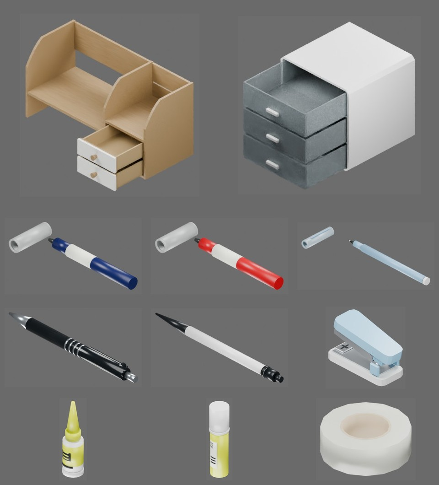

# 01 单图资产建模与形状验收

本章以三抽屉塑料盒子和黑色圆珠笔为例，完成 **参考图片 → Python 建模 → 配置预览 → 自动检查与渲染 → 人工验收**。AI 应阅读本章及引用的资产规范后编写或修改资产源码。

本阶段同时完成视觉与碰撞形状，验证活动空间和复杂度。质量、摩擦、受力运动及 USDZ 导出在下一章处理。

**输入：单张参考照片。** 尺寸和不可见结构由 AI 根据图片与常识推断。


**输出：照片中物品的独立资产。** 下图展示开放的抽屉和分离的笔帽；布局用于比较外观，未按实物尺寸等比例摆放。



三抽屉盒子的几何开合预览（非动力学）：

<video controls preload="none" poster="images/cabinet-open.jpg" src="images/cabinet-open.mp4"></video>

[打开视频](images/cabinet-open.mp4) · [查看静态展开图](images/cabinet-open.jpg)

## 1. 准备输入与环境

本章主要示例是参考照片左上方的三抽屉盒子，以及桌面中下方带银色环的黑色圆珠笔。

- [盒子](../../asset_sources/objects/cabinet/000002/)：外壳、三个空心抽屉，共四个刚体。
- [笔](../../asset_sources/objects/pen/000001/)：笔壳与包含按钮、笔芯、笔尖的活动组件，两个刚体与一个滑动关节。

同一照片中的其他文具也提供独立源码：[白黑按动笔](../../asset_sources/objects/pen/000002/)、[订书机](../../asset_sources/objects/stapler/000000/)、[尖嘴胶水](../../asset_sources/objects/glue/000000/)、[固体胶](../../asset_sources/objects/glue/000001/)、[胶带](../../asset_sources/objects/tape/000000/)、[蓝色粗笔](../../asset_sources/objects/pen/000006/)、[红色粗笔](../../asset_sources/objects/pen/000004/)、[浅蓝细笔](../../asset_sources/objects/pen/000005/)和[双抽屉木架](../../asset_sources/objects/cabinet/000001/)。

安装 uv、Blender 和 FFmpeg，并确保终端能找到 `uv`、`blender`、`ffmpeg`。本章实测 Blender 4.5.14 LTS。以下命令均在仓库根目录执行：

```bash
uv sync --locked
```

外层 uv 环境负责启动 Blender，没有运行时第三方依赖。建模、检测和渲染使用 Blender 自带的 Python、bpy、bmesh、mathutils 和 NumPy，通过源码路径导入本项目；无需向 Blender 安装宿主 `.venv` 的依赖。

## 2. 编写资产源码

根据提供的参考图和要求，为每个资产编写 `object.py`。编写前阅读 [object.py 与模型规范](../designs/asset-pipeline/modeling.md)，按其要求定义刚体子树、视觉与碰撞几何、坐标系和关节。资产文件按[布局规范](../designs/asset-pipeline/README.md#资产布局)保存。可参考已有的资产源码 [盒子 object.py](../../asset_sources/objects/cabinet/000002/object.py)。

## 3. 生成模型

使用[统一构建入口](../../scripts/assets/build_assets.py)：

```bash
blender -b --python-exit-code 1 -P scripts/assets/build_assets.py -- --assets cabinet/000002 pen/000001
```

`--source` 和 `--output` 可指定源目录和产物根目录，默认为 `asset_sources/objects` 和 `assets/objects`；不提供 `--assets` 时默认构建所有资产。

## 4. 配置预览并验收

验收按三步执行：设计 `preview.json` → 运行 `validate_and_preview` → 检查报告并人工查看图片、视频。自动检查和人工检查均通过，才能交付。

### 4.1 设计 preview.json

编辑预览配置 `preview.json`，按 [preview.json 规范](../designs/asset-pipeline/preview.md) 设计视角和运动覆盖。先确认静态图能看清资产，再设置关键帧。可参考 [盒子 preview.json](../../asset_sources/objects/cabinet/000002/preview.json)，盒子的三个抽屉依次拉出至 0.173 m，再依次关闭。带盖笔可参考 [pen/000006 的配置](../../asset_sources/objects/pen/000006/preview.json)，展示拔帽和分离摆放。

### 4.2 执行自动检查与渲染

运行[自动检查和渲染](../../scripts/assets/validate_and_preview.py)：

```bash
uv run python scripts/assets/validate_and_preview.py assets/objects/cabinet/000002/object.blend \
  --views asset_sources/objects/cabinet/000002/preview.json
uv run python scripts/assets/validate_and_preview.py assets/objects/pen/000001/object.blend \
  --views asset_sources/objects/pen/000001/preview.json
```

脚本先执行自动化检查，通过后渲染。失败时退出非零。结果输出到模型旁的 `preview/`，保存报告与预览，图片和视频均为**左视觉、右碰撞**；右侧按刚体着色。

| 资产 | 预期输出 |
| --- | --- |
| 盒子 | `acceptance.json`、六视图与四分之三 JPG、`open_three_quarter.jpg`、`open.mp4`（24 FPS，73 帧） |
| 笔 | `acceptance.json`、六视图与四分之三 JPG、`pressed_three_quarter.jpg`、`press_and_extend.mp4`（24 FPS，49 帧） |

常用参数：

- `--output DIR`：指定输出目录；默认使用模型旁的 `preview/`。
- `--check-only`：仅生成自动检查报告，不渲染，适合调试。
- `--device auto|cpu|gpu`：默认优先使用可见 GPU，无可用后端时使用 CPU；`gpu` 要求 GPU 可用。
- `--views` 省略时仅使用零位渲染前、右、顶和四分之三视图。

渲染不回写模型。粗测允许正常接触，超过容差的穿透判为失败。

### 4.3 检查结果并决定是否通过

**先检查自动报告。** 打开两个 `preview/acceptance.json`，按[自动检查与人工验收](../designs/asset-pipeline/preview.md#自动检查与人工验收)核对结果。本例盒子应覆盖 81 个样本、4 个刚体、3 个关节；笔应覆盖 57 个样本、2 个刚体、1 个关节，两者均无禁碰对。

示例复杂度应为：

| 总量 | 盒子 | 笔 |
| --- | ---: | ---: |
| 视觉三角数 | 588 | 1036 |
| 基础碰撞形状数（BOX） | 21 | 2 |
| 凸网格数量 | 12 | 35 |
| 凸网格顶点/面总数 | 160 / 104 | 352 / 246 |

**再人工查看预览结果。** 打开资产 `preview/` 中生成的 JPG 和 MP4，人工确认结果是否符合要求。

从模型导出资产树：

```bash
blender -b --python-exit-code 1 -P scripts/assets/export_asset_tree.py -- \
  assets/objects/cabinet/000002/object.blend --output outputs/cabinet-tree.txt
```

导出结果自动缩写重复组件。将核对后的资产树放入对象 README，并按[部件命名要求](../designs/asset-pipeline/modeling.md#部件命名与资产树)确认部件及其刚体归属。

不通过时，记录失败项、图片名或视频帧号：形状、结构或复杂度问题修改 `object.py` 并重新生成；视角和运动覆盖问题修改 `preview.json`。随后重新执行自动检查与人工查看。

## 5. 留存成果

自动报告和人工检查均通过后，按[布局规范](../designs/asset-pipeline/README.md#资产布局)留存源码、配置、README 和缩略图；模型、完整预览与报告保留在生成目录。

从完整预览生成黑笔源目录缩略图：

```bash
ffmpeg -hide_banner -loglevel error -y -i assets/objects/pen/000001/preview/three_quarter.jpg \
  -vf scale=480:240 -q:v 2 -frames:v 1 asset_sources/objects/pen/000001/three_quarter.jpg
```
